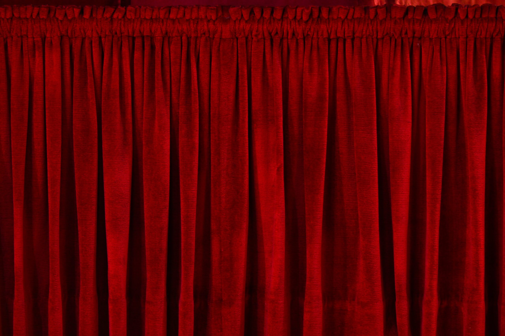
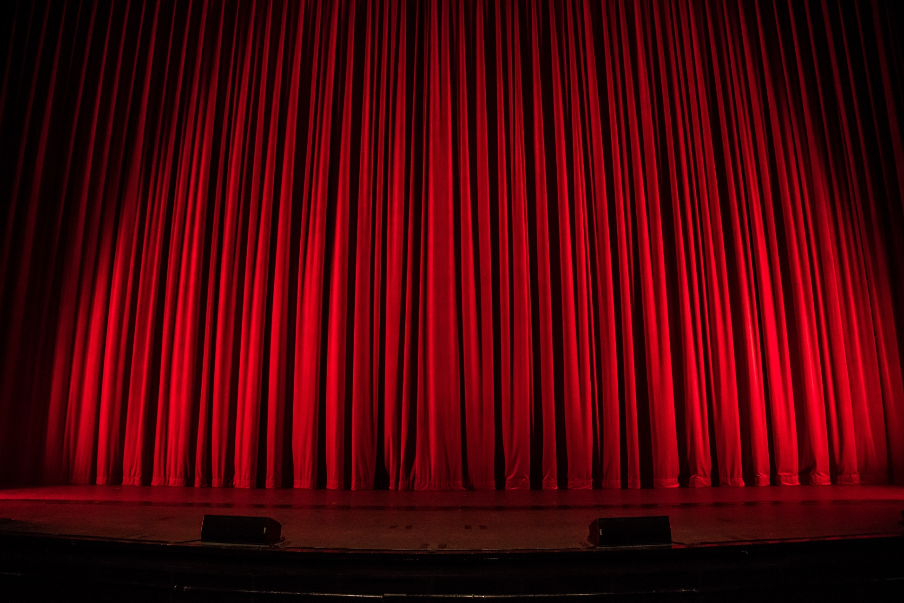
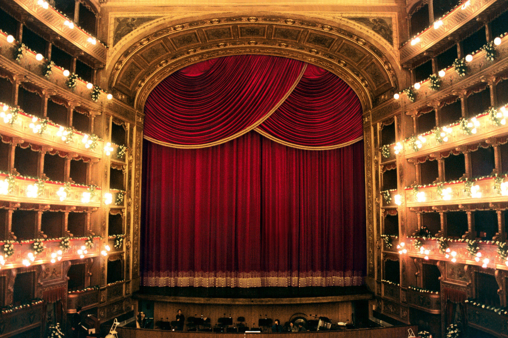

# 红绒幕布参考

收集日期：2026-09-19。用于后续幕布颜色、绒面和运动设计；素材保存在 references 子目录，不作为网站发布资产。

## 照片（已下载并逐张视觉核对）

### 1. 绒面近景：优先参考材质

- [来源：Musicalzentrale](https://musicalzentrale.de/85363/hair-44/)
- [原图](https://musicalzentrale.de/wp-content/uploads/2023/05/vorhang-scaled.jpg)
- 观察：细密的横向绒纹、宽窄不一的褶皱、暗红沟槽和柔和亮面。比均匀噪点更适合作为毛茸茸质感的参照。

### 2. 正面舞台：优先参考颜色与重量

- [来源：Dramatic Theatre](https://www.dramatictheatre.net/)
- [原图](https://static.wixstatic.com/media/6c5f40_fdae27d9bcea47cca6b2b90ca5693480~mv2.jpg)
- 观察：鲜红亮面与近黑褶谷并存；下摆落地，局部略有堆积。颜色可借鉴，不能把高光做成等宽的塑料亮条。

### 3. 剧院全景：参考厚重层叠

- [来源：Peroni](https://www.peroni.com/lang_ES/ext_panel_immagine.php?imgid=121331)
- [原图](https://www.peroni.com/mobile/lang_ES/_imgschede/TMassimoSipario_01ab.jpg)
- 观察：密集褶皱和多层布料形成深阴影。只提取厚重感；金边、帷幔和剧院装饰不适合直接搬到当前网页。

## 视频

### 1. 红布运动近景

- [Pexels：Moving Red Curtain](https://www.pexels.com/video/moving-red-curtain-4863244/)，作者 Kaboompics。
- 本地：[moving-red-curtain-4863244.mp4](references/moving-red-curtain-4863244.mp4)。
- 页面标注约 19 秒、1080×1920、30fps；用于观察布面亮暗随运动变化。页面内容已核对，完整视频运动尚未逐帧分析。

### 2. 手拉红幕

- [Pexels：Pulling the Curtain](https://www.pexels.com/video/pulling-the-curtain-7946010/)，作者 Hanna Pad。
- 本地：[pulling-curtain-7946010.mp4](references/pulling-curtain-7946010.mp4)。
- 用于后续观察牵引位置附近的折叠与布料变形；人工牵引与双侧轨道开幕不能直接等同。页面内容已核对，完整视频运动尚未逐帧分析。

### 3. 之前已查看的真实开幕

- [Pexels：Opening Curtain for the Start of a Stage Play](https://www.pexels.com/video/opening-curtain-for-the-start-of-a-stage-play-6899898/)。
- 已有本地关键帧：[6 秒](reference-6.png)、[8 秒](reference-8.png)、[10 秒](reference-10.png)、[12 秒](reference-12.png)。
- 用于比较中央缝隙扩大、折叠收拢和布料边缘形变。关键帧来自此前观察，原始视频未在本目录下载。

## 后续可查资料

- [ShowTex：幕轨运动类型](https://www.showtex.com/en/knowledge-hub/types-track-movement)：研究双侧开合与侧边收拢结构。
- [ShowTex OrientTrack 视频](https://vimeo.com/492012624)：轨道运动参考，链接存档，未下载。
- [Pixabay：Theatre Curtains / Open Curtains](https://pixabay.com/videos/theatre-curtains-open-curtains-240995/)：候选补充视频，链接存档，未下载或完成视觉核对。

## 下一轮设计提取

- 颜色优先参考正面舞台图的红色，避免偏紫；暗部保留酒红层次。
- 绒面优先参考近景图的低对比细纹，避免粗颗粒和砂纸感。
- 褶皱需要宽窄变化、柔和明暗和深沟槽，下摆体现重量。
- 运动需要结合视频继续检查牵引与折叠，不能仅靠照片判断速度和惯性。

## 来源与使用

照片版权归原作者或来源方；这里仅收集用于设计研究，未确认其网站发布授权。两个新增 Pexels 视频页面均链接至 [Pexels License](https://www.pexels.com/license/)。下载文件不代表应将其加入生产资源或提交大体积视频到 Git；本次未提交、推送或部署。
