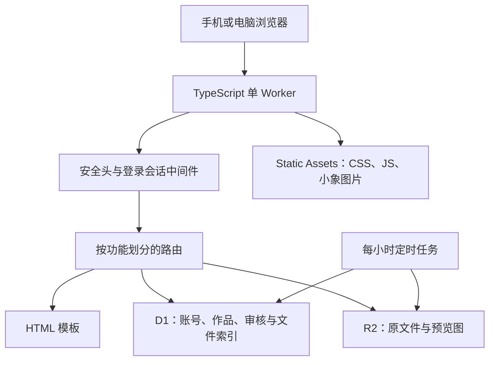

# 黑匣子后端优化方案（待决定，不执行）

审查日期：2026-09-10。代码基线：`c4d30f9`。当前正式架构：TypeScript/Hono 单 Worker、D1、R2、Static Assets；视频上传暂停，网站已开始内部测试。

本文是后续实施建议，不表示这些改动已完成。本次只审查源码、迁移和部署脚本，并在一次性内存 SQLite 中模拟审核冲突；未读取真实账号内容、未修改本地业务库或线上数据、未部署。未读取 `docs/旧密码`。未做生产压测，本文没有承诺节省百分比。

## 1. 结论与建议选择

**保留单 Worker，分阶段局部重构。先保证数据一致，再降低重复请求，最后整理代码。**

当前规模约 30 人，现有架构没有根本性选型问题。无需切回 Python，也无需拆微服务、拆独立前后端、引入 Redis、另一个数据库或复杂消息系统。数据库参数绑定、角色区分、签名会话、密码修改后会话失效、资料审核和文件流式传输等已有基础应继续保留。

优先建议实施两个包：

1. **可靠性包**：审核并发与唯一约束、上传完成幂等、文件删除补偿、上传类型及额度边界、关键接口回归测试。
2. **低开销包**：公开静态资源绕过业务 Worker、公开封面使用轻量展示图、统一缓存规则、资料库按作品分页、清理无效请求与重复统计。

等前两包稳定后，再整理服务层、数据库访问和类型。不要把格式整理与数据库迁移混在一次大提交里。

## 2. 当前架构及边界



路由已经按账号、队员、作品、资料、上传、内容、建议、管理员拆开，这是好的起点。但一个路由函数往往同时解析表单、判断权限、执行多条 SQL、操作 R2 和拼接响应。尤其跨 D1/R2 的步骤，失败处理不够完整。

主要依据：`src/index.ts`、`src/routes/`、`src/storage/`、`src/auth/`、`src/middleware/`、8 个 SQL 迁移和 `scripts/predeploy.mjs`。

## 3. 第一优先级：让现有数据和业务结果可靠

### A. 审核必须防重复和防并发冲突

**已确认的代码问题，并已用内存 SQLite 模拟对应 SQL 执行顺序。**

- 队员认证申请只有“查询是否已存在，再插入”，没有“同一账号最多一条 pending 申请”的数据库唯一约束。并发请求可插入两条。
- 新档案审核先插入 member，再有条件更新 user 和 join_request。两个审核者都读到 pending 后，第二个批次可能插入新档案，但后两条 UPDATE 影响 0 行，仍成功提交，留下多余档案。
- 作品加入审核先插入演职员，再更新 pending 申请。若另一管理员已驳回，仍可能得到“申请 rejected、演职员已插入”的结果。
- `production_credit` 缺少同一作品、队员、类别、角色的唯一约束。待审核申请有唯一索引，并不等于最终演职员表也防重复。

定位：`src/routes/admin.ts:146`、`src/routes/members.ts` 的认证提交、`src/routes/productions.ts:370`、`migrations/0001_core.sql`、`migrations/0006_multiple_production_roles.sql`。

**建议：**

- 为 pending 认证申请和最终演职员关系补充恰当的唯一索引；先生成历史重复数据报告，再决定如何合并。
- 将审核状态转移和实际业务写入放在同一个有条件的 D1 事务批次中。所有后续写入必须受本次审核成功条件保护，必要时用操作标识或数据库约束使冲突中止。
- 不能只在 batch 后检查 changes：那时前面已提交的写入不能自动撤回。D1 batch 能在语句失败时回滚，但 UPDATE 命中 0 行不是 SQL 失败。[D1 batch 说明](https://developers.cloudflare.com/d1/worker-api/d1-database/)
- 重复请求应返回已处理结果或明确的冲突；禁用、解绑与审核并发时，也要校验账号当前身份与档案绑定。
- 保留 AB 角与一人多角：唯一范围必须包括 member_id、kind、role_name，绝不能按“作品 + 角色名”唯一。

**验收：**双击通过、通过和驳回并发、审核期间解绑/禁用、两个队员饰同角色、一人多角色。最终只有一个合法结果，不产生孤立档案或重复演职员。

### B. 上传完成需要能重复调用并恢复中途失败

**已确认代码存在跨存储失败窗口；尚未断言线上发生过。**

当前流程是 `completing → R2 合并 → INSERT resource → UPDATE upload_task`。R2 合并成功后，如果 D1 写入失败，catch 会把任务退回 uploading，但 R2 multipart 可能已经完成，下一次不能按普通未完成任务继续。资源插入成功、任务更新失败也可能留下状态不一致。

定位：`src/routes/uploads.ts:282` 附近。

**建议：**

- 保留现有任务 ID、分片和资源 ID；为新资源增加可空的 `source_upload_task_id`，建立唯一约束作为重复完成的防线。旧资源保持 NULL，不强制补造历史任务。
- 同一个完成请求再次到来时，如果已经完成，直接返回原 resourceId。
- 完成时先取得受条件保护的任务处理权；校验实际 R2 对象状态与字节数。R2 已合并但 D1 未落库时，恢复后续数据库步骤，不能盲目重置为 uploading。
- 资源插入和任务 completed 更新合并为同一 D1 事务批次；R2 与 D1 无法靠 D1 事务做到一起回滚，必须设计补偿和恢复。
- Cron 区分“过期未合并”与“合并后未登记”，不要把所有 completing 任务都当废文件清理。
- 请求入口检查 expires_at；当前只靠 Cron 清理，可能允许已过期但尚未扫到的任务继续操作。

**验收：**在 R2 合并前后、D1 插入前后、响应丢失时注入失败；重试后只产生一份资源，旧任务可续传或取消。

### C. 删除文件与换头像需要补偿机制

当前删除资源先删 R2，再清理 D1；D1 失败会留下“资料存在但文件已消失”。换头像先上传新对象再改数据库，也存在孤立文件窗口。Cron 每次处理最多 50 个任务，失败重试和长期记录回收还不完整。

定位：`src/routes/resources.ts:250`、`src/routes/members.ts` 的头像上传、`src/storage/cleanup.ts:12`。

**建议：**先在 D1 中记录删除意图并使资源不可见，同时记下待清理的对象键；然后由可重试任务删除 R2。重复删除应成功，暂时失败可稍后恢复。第一阶段用一个 D1 清理任务表配合现有 Cron 即可，不必立即增加付费队列。

新头像写入失败时安排清理新对象；成功后再清理旧头像。终态上传任务和分片记录按确认的保留期限清理；未完成分片和已完成对象分别处理。不要对整个桶设置可能误删正式资料的过期规则。

**验收：**模拟 R2 或 D1 不可用，前台不出现已删除资料；重试能完成清理。恢复数据库备份时检查文件仍在，不能只恢复 D1 就认为资料恢复完成。

### D. 文件类型和免费额度必须在服务端有边界

当前原文件的 MIME 来源是客户端请求；`/resources/:id/media` 统一 inline 返回 R2 保存的 MIME。预览图和头像有部分文件头检查，但原文件没有同等的可信类型分类。不能只因有 CSP 就允许上传内容在网站同源直接解释为 HTML 或脚本。

视频拦截检查了类别、MIME、扩展名，但不能识别任意改名且伪造 MIME 的视频内容。非视频仍可声明接近 10GB 的文件；没有账号级并发任务数或全站容量预留机制。**暂停视频不等于 R2 免费额度已有硬上限。**

定位：`src/routes/uploads.ts:13`、`:70`、`src/routes/resources.ts:123`。

**建议：**

- 定义后端统一上传策略：视频关闭、允许的类别/扩展名/可信 MIME、各类大小上限、每账号并行任务上限。前端从策略获取提示，后端最终执行。
- 图片用受支持格式的内容特征确认，PDF 检查基础格式；不能可靠识别的文件按普通附件处理。不要把简单文件头检查描述成完整病毒检测。
- 只有安全白名单类型允许预览；HTML、SVG、脚本和未知类型走 attachment，并覆盖不可信 MIME。保留图片和 PDF 的正常预览体验；是否需要隔离预览域名以后再决定。
- 小文件可增加直接 PUT 路径，沿用同一任务和审核服务；大文件 multipart 继续保留，视频保持禁用。
- 大小上限可先讨论采用“图片 20MB、文档 50MB、音频/其他 100MB”的试运行值。这些是建议，不在本次生效，也不拒绝读取已经存好的大文件。
- 以后增加容量预算时，用 D1 原子预留字节数处理并发，计入待审核文件、预览图、头像和未完成任务，上传结束核对实际大小。为 R2 免费空间保留余量。
- 账号内预算无法限制控制台直接上传、其他桶占用或高频读取费用；仍需 Cloudflare 用量观察。R2 免费额度超出后可能计费。[R2 计费](https://developers.cloudflare.com/r2/pricing/)

## 4. 第二优先级：减少开销和改善加载

### E. 公开静态资源直接走 Static Assets

`wrangler.jsonc:10` 设置 `run_worker_first: true`，`src/index.ts:20` 对所有请求加载会话。CSS、JS、小象图片也进入 Worker；带有效 Cookie 时还会查询一次 user。

建议让公开静态文件优先由 Static Assets 返回，登录、审核、资料、头像和动态接口继续走 Worker。仅公开样式和应用脚本，不开放 R2 内部资料。直接返回的静态文件需要用 `_headers` 配好必要响应头，不能依赖已绕过的中间件。

收益可以精确按请求计算：每个被绕过的静态请求减少一次 Worker 执行，带有效会话时还减少一次用户查询。不承诺全站减少固定百分比。Static Assets 直接请求不按 Worker 动态请求计费。[计费说明](https://developers.cloudflare.com/workers/static-assets/billing-and-limitations/) / [路由说明](https://developers.cloudflare.com/workers/static-assets/routing/worker-script/)

**必须保留：**动态请求依旧查询当前账号，保证禁用、解绑和改密码立即生效。不能为了少一次 SQL 就把身份缓存很久。

### F. 统一图片服务、缓存与更新失效规则

首页首屏、全站背景、精选封面存在三套很接近的“查询 → R2 → Headers”代码，且都读取原图。此前迁移清单包含数 MB 到十余 MB 的照片，不适合每次当小封面或模糊背景使用。

现有固定地址缓存一小时，换图后浏览器可能继续显示旧图；设置了 ETag，却没有完整处理条件请求。全站 CSS 即使没有背景图也会请求 `/site/background`，返回 404 仍有 Worker/查询成本。

建议抽出小型文件响应模块：可信 MIME、inline/attachment、权限、ETag/304、Range/416、Content-Length、If-Range 统一处理。Range 不能仅凭“有 Range 请求头”就返回 206。[R2 条件与范围请求](https://developers.cloudflare.com/r2/api/workers/workers-api-reference/)

- 列表用现有缩略图；首页新增适度大小的展示图，旧文件暂时回退原图，后台分批补生成，保留原始剧照。
- 公开精选图 URL 携带作品/图像版本，换图就换 URL；服务器仍验证该图确实属于当前公开内容，不接受任意资源 ID 作为公开图。
- 内部媒体先鉴权再返回；共享边缘缓存不能绕过权限。身份页、后台 JSON、带 CSRF 的响应明确 `private, no-store`。目前 noStore 仅覆盖少数路径，这不等于已发生缓存泄露，但策略需要补齐。
- 没有全站背景时不输出背景请求。公开图片是否做边缘 Cache API 缓存待流量测量后决定，缓存键和撤销可见性要同时设计。

### G. 资料库按作品分页，索引以实际查询为依据

资料库、我的提交、公告、建议等存在全量查询；队员和管理员列表虽然有 LIMIT，但达到上限后没有下一页。资料增多会增加 D1 行读取和 HTML/图片请求。

定位：`src/routes/resources.ts:42`、`:61`、`src/routes/members.ts` 列表、`src/routes/suggestions.ts` 收件箱。

建议按作品组分页，再读取当前作品组内必要资源；剧照集采用封面、数量、进入后分页。必须保留“作品在前，其他资料最后”“组内按提交时间”“按作品名搜出关联资料”的规则。不能直接把当前全量查询加 LIMIT 而导致剧照卡缺照片或搜索不全。

候选索引：资源的状态/作品/时间/ID组合、上传者/时间/ID组合；演职员身份组合；待办建议的类别/状态/ID。是否加入由内存迁移后的 `EXPLAIN QUERY PLAN` 和脱敏规模数据验证决定。

`LIKE '%关键词%'` 通常不能靠普通 B-tree 索引解决。当前小规模继续使用即可；资料明显增长后再讨论全文搜索，中文分词与子串搜索不能直接视为等价。避免一次添加很多未使用索引，增加写入负担。

### H. 通知和下载计数不要反复扫描或写入

管理员每次打开页面会额外请求通知接口，接口重复聚合五类待办，并读取该管理员所有历史通知键。目前不是定时高频轮询，不应误称为“每秒查询”。历史已读表随着新通知不断增长。

可以合并工作台和通知计数查询；已读记录按“管理员 + 类别”存最后看到的事件序号，先兼容读取旧通知键，再回填新表。需要定义新事件的单调序号，避免最大 pending ID 回退时旧通知重新出现。不要无期限缓存，错过新申请。

每次 `/download` 都同步更新 download_count，Range 分段请求也计数，既可能失真，也让下载依赖 D1 写入成功。先决定是否真的需要这个数字；若保留，按一次下载意图记数并去重，而非每个字节片段计一次。不用读取后简单覆盖计数，以免并发丢失。

## 5. 第三优先级：让代码容易理解

### I. 只把复杂业务抽成服务，不把每条 SQL 都包多层

建议渐进形成以下边界：

```text
src/
  index.ts           注册入口与错误处理
  middleware/        登录、管理员、CSRF、缓存策略
  routes/            URL、输入解析、调用业务、返回页面或 JSON
  services/          先放 reviews、uploads、resource-files 三个复杂业务
  storage/           R2 绑定/直传适配、清理任务
  auth/              密码与会话
  views/             页面模板
  types.ts           公共类型；领域类型逐步下沉
```

等某一领域 SQL 重复到影响维护时，再加对应查询模块，不急着引入全站 repository 框架或 ORM。简单公告 CRUD 可以暂时留在路由。

具体可消除的冗余：

- `requireAdmin`、`adminOnly`、`adminDenied` 和多套路径字符串判断，收敛为有明确作用域的强类型中间件。页面未登录重定向、API 未登录 JSON 401 的行为分别保留。
- 同一个资源可见性规则在详情、预览、media 重复，收敛为 `canViewResource`；下载仅允许已审核的现行规则不要误合并丢失。
- 视频关闭检查重复出现在每个上传处理器，前后端都有扩展名列表；放进任务访问/上传策略入口，DELETE 取消仍允许。
- `upload_mode='local'` 在线上实际表示“经 Worker 绑定 R2”，命名容易误导。代码层改称 binding，数据库旧值 local 继续映射，首阶段不重建 CHECK 表。
- `feature_layout` 已同时影响首页和作品卡片。界面已改名，数据库字段无需为追求漂亮而立即改名，可用类型别名表达。
- 资源 SELECT 字段和图片响应构造重复，优先做小型共享函数。
- 将关键 `any` 替换成 `Context<AppEnv>` 和明确请求类型；统一整数 ID、字符串长度和请求体大小校验。

**避免重构过度：**没有必要统一所有表名、改所有 URL、替换模板系统、把 Hono 换成另一框架或为了“整洁”删除仍用于回滚的历史迁移。

### J. 未使用字段和旧代码分开处理

运行代码未发现 `email_token`、`member_resource`、`join_hint_seen`、`mail_sent_at` 等完整业务使用；邮件功能尚未开放，一些是历史兼容保留。`contact_wechat/public_account` 仍在内容读取和写入中，不能简单认定为空用字段。

先列出“已用、为兼容保留、计划用、可归档”清单，停止继续扩散引用。**保留数据库列和表不会造成明显日常请求开销，没必要冒丢数据风险立即删除。**

`legacy-python/` 不进入 Worker 运行包，留着不会产生云端运行费用。以后可以放入独立归档，但遵循用户此前保留原站要求。S3 直传路径暂停使用却有未来大文件价值，隔离适配器和测试即可，暂不删除。

## 6. 运行保障与证据补齐

### K. 密码、限流和错误处理

- 继续兼容现有 Werkzeug scrypt 密码；不要统一重置用户密码，不为了免费额度降低哈希参数。
- `scryptSync` 的真实 CPU 使用需要看 Workers 指标和本地 CPU profile。之前测试中 `elapsedMs=0` 不能作为零成本证据，线上计时器在没有 I/O 时可能不前进。[计时器说明](https://developers.cloudflare.com/workers/runtime-apis/performance/) / [CPU 分析](https://developers.cloudflare.com/workers/observability/dev-tools/cpu-usage/)
- 若将来确需迁移哈希方案，采用带版本的多格式读取、登录成功后更新，保留旧哈希验证直到存量迁移完；先实测，暂不决定新算法。
- 源码未见登录/注册/申请/上传任务频率限制；Cloudflare 控制台规则本次未核查，不能断言线上完全没有防护。先核查再补，优先在昂贵哈希和创建 R2 任务之前限制。
- 校验登录 next 为同源相对路径，包括反斜杠及编码异常用例；不只判断是否以双斜杠开头。为登录密码也设输入长度上限。
- 全局 onError 目前一律纯文本 500。应保留业务预期的 400/401/403/409，API 输出稳定 JSON 错误码；不要把数据库不可用伪装成“用户名重复”。
- 增加 requestId、路由、耗时、存储操作结果和重试次数日志，不记录密码、Cookie、CSRF、邮件 token 或文件正文。

### L. 验收、备份与部署门槛

`deploy:check` 当前包含格式、类型、迁移转换测试和 dry-run；`smoke:production` 只有首页、健康、CSS、作品/公告未登录保护。这些通过，不代表登录、审核和上传等关键业务都已自动验收。

应把历史散落的临时验证整理成可重复运行的正式测试：

1. 旧密码、改密码/禁用/解绑失效、角色访问矩阵。
2. 双重审核、并发建档申请、AB角和一人多角。
3. 上传权限、暂停视频、过期、重复完成、D1/R2 故障恢复。
4. 私有资源、公开封面、附件类型、HEAD、Range、缓存撤销。
5. 从现有 8 个迁移升级到新迁移，验证旧 ID、外键、引用、旧布局值和文件访问。

统一入口可以是未来新增的 `npm run test:backend`。本次不添加执行性发布配置或自动化任务。

`/health` 当前只表示 Worker 能响应，不代表 D1/R2 正常。保留便宜的存活检查，另设低频、有权限限制的依赖检查；不要每次探活都列桶或全表扫描。

数据库变更前导出 SQL；D1 Free Time Travel 可回到过去 7 天，但它不能恢复已经删除的 R2 对象。[备份说明](https://developers.cloudflare.com/d1/reference/time-travel/)

README 和验证记录仍有“尚未连接云端”“四个 Secret”的过期描述。后续实施时单独文档提交，区分“历史验收”“本地当前验收”“生产当前验收”，不能把历史测试一律描述成线上已通过。

## 7. 兼容现有数据的实施规则

1. **不重置数据库，不覆盖导入旧快照。**所有历史 ID、URL、密码哈希、对象键、审核记录和资料归属继续使用。
2. **只加新迁移，不改已运行的 0001–0008。**先新增可空列、新表或索引；旧应用仍可读写的结构优先。
3. 新唯一约束前检查重复行。AB角和一人多角是合法关系，不能按“角色名相同”去重。真实重复先输出报告，明确保留规则再处理，保留处理前快照。
4. 读新结构、回退旧字段；新增上传策略仅限制后续提交，不删除或隐藏合法已入库资料。
5. `upload_mode=local`、已有任务 ID/分片、`feature_layout`、文本形式的背景引用保留兼容。必要转换采用新增字段、分批回填、核对、切读的顺序。
6. 回填不一次扫全量文件：先按 D1 索引分页取得候选键，再受限读取 R2；记录进度和错误，可中断续做。
7. 每包先在独立本地模拟环境升级一份受保护快照，跑计数、外键与业务回归；真实导出不进 Git，也不把真实档案放入公开测试夹具。
8. 正式发布选择少人使用的时间。小改动代码先回滚到上个兼容版本；数据库已新增的数据不能因回滚代码被删除。涉及破坏性变更时单独设计回退，不和普通发版混做。
9. D1 与 R2 分开备份核对；延迟永久删除可提供短期恢复窗口，保留时长须兼顾隐私和容量预算。

## 8. 建议实施顺序与验收出口

### 第 0 包：建立可信基线（工作量较小）

确认当前生产版本、备份路径及恢复方法；补关键业务回归测试；观察正常访问下的 Worker 请求、CPU、D1 行读写、R2 字节数与操作量。不对正式站点做并发压测。

出口：测试可复跑，已知问题有用例，能区分“代码通过”和“业务通过”。

### 第 1 包：可靠性与边界（工作量中等，最优先）

按 A → B/C → D/K 的小批次实施，每一步可单独验收、发布。必要时先处理同源不可信文件预览，再处理其他事项。复杂度主要来自存量数据和失败恢复，不来自页面数量。

出口：重复或失败请求不产生多余业务记录；R2/D1 不一致有可执行恢复路径；危险文件类型和上传预算有明确规则。

### 第 2 包：低开销读取（工作量小到中等）

E 静态分流 → F 图片/缓存 → G 分页/查询计划 → H 通知/计数。先挑不改变数据库的静态分流，单独测量收益。

出口：公开静态文件不触发账号查询；私有资源仍有权限；页面只读所需分组；图片字节数下降且更换封面及时生效。按相同测试场景对比前后，不用主观“更快”替代指标。

### 第 3 包：结构与文档收口（工作量中等，可渐进完成）

逐域迁移到少量服务模块、收紧类型、整理未用字段清单、归档旧说明。跟随已经测试过的业务逐步抽取，避免一次搬动所有文件。

出口：路由易读，业务规则只有一个可信入口；旧 API、数据库和数据保持兼容；文档单独提交。

## 9. 以后开始前需要你决定的产品细节(我回答了)

- 上传上限：是否接受按图片/文档/音频分类设置大小限制；免费预算是否提前在约 8GB 暂停新任务，为已有文件和临时分片留余量？回答：接受限制，主要开放图片，剧照为主。可以再9gb暂停，
- 删除恢复：直接永久删除，还是保留例如 7 天的恢复期？建议短期恢复，但需计入存储预算。直接删除
- 下载次数：是否真的需要显示准确计数？建议暂不把每次下载变成必须成功的数据库写入。这个下载次数的部分可以完全删掉了，没有记录下载次数的需求。
- 审核历史：建议保留处理人、时间、结果和理由，对的；账号删除后使用脱敏处理人标识，不破坏历史链路，好。
- 重复历史行：仅处理完全相同的重复记录，还是由管理员逐条确认？建议先出报告，不自动猜测角色含义。由管理员确认
- 后续视频：保持当前关闭，重开前另做大文件、容量预算和大陆网络验收。嗯嗯

先同意“第 0 包 + 第 1 包”，另将 E 静态分流作为独立小改动；不启动全量重写。

## 10. 本轮实施记录（2026-09-10 完成本地，2026-09-11 联合发布）

按照第 9 节已确认的范围，仅实施第 0/1 包的可靠性改造与 E 静态分流；后续分页、缩略图回填、通知汇总和全站重构未启动。

本地已实现并验证：

- 审核条件更新、原子建档/绑定/演职员写入；保留 AB 角、一人多角，完全重复由唯一约束拦截。
- 审核历史入口，记录新审核的处理人、时间、结果和说明；删除处理人后匿名显示，缺失的旧历史不伪造。
- 上传分类上限、每账号 3 个任务、9GB 容量台账与预留；首次包含旧 R2 文件，视频继续拦截。
- 分片流式长度校验、已合并对象恢复、重复完成不重复入库、过期和取消清理。
- 资料与头像删除意图入库、后台重试及共享对象保护；按用户选择直接删除，没有七天回收站。
- 文件安全类型、HEAD/Range/条件响应、私有权限重新校验；停止下载次数写入，旧列为数据兼容保留。
- 认证和提交频率限制、同源 next、动态缓存边界、请求编号、管理员依赖检查。
- Static Assets 优先响应。真实本地 workerd 验证 CSS 不经过账号/数据库查询。
- 30 项隔离后端测试，真实 D1/R2 本地运行时、旧数据转换和不发布打包。
- 优化前生产 SQL 快照仅在内存升级，16 张原业务表的原字段、行数、ID、密码哈希和关系均未变化。
- 新增迁移 0009–0011；保留 0001–0008、旧对象键、旧 URL 和 Python 对照目录。

生产预检时重复待审认证和完全重复演职员均为 0。仍需在发布窗口重新备份并预检，因为试运行数据会继续变化。本轮没有把新迁移和新代码发到生产，没有对线上做压力测试。

尚待实际发布后观察：正常访问的 CPU、D1 行读写、R2 字节/操作量、免费额度以及大陆不同网络表现。这些没有用本地测试结果代替。当前单 Worker 和绑定 R2 架构继续使用，不启用视频或 S3 直传。

发布与回退注意事项见 [架构与部署](架构与部署.md)，队员/管理员点击检查见 [本地验收指南](本地验收指南.md)。此记录不改变第 9 节用户的产品选择。

## 联合发布结果（2026-09-11，最终状态）

- 已发布到 https://npublackbox.online/ 。Worker 版本：`5d630f67-a648-4e08-b1e4-cf519cb380c3`。
- 生产增量迁移 0009–0012 全部成功。触发器 CASE 使用括号兼容远程解析；最初失败已确认回滚，修复后重试成功。
- 部署前备份：`migration-work/backups/blackbox-production-2026-09-11T13-55-35Z.sql`。内存升级验证原字段/ID/密码哈希/引用/行数一致。发布后 14 个账号、7 份档案、2 部作品、10 份资料保持，外键检查为空。
- 38 项自动回归、格式、类型、转换和 dry-run 通过；上线后 9 项公开页面及后台保护冒烟全部通过。
- 本地截图与点击验收覆盖首页两幕、手机导航、队员名录和资料库。线上已核对浏览器首页内容树；截图通道超时，线上结果同时以 HTTP 冒烟和 D1 只读核验为证；不声称所有手机型号、缩放、慢网或大陆运营商均完成验收。
- 视频保持禁用；没有增加付费服务。重复指纹为辅助规则，旧资料未回算全量哈希。更多数据量的服务端分页、真实流量下费用/CPU 对比保留为后续工作。
