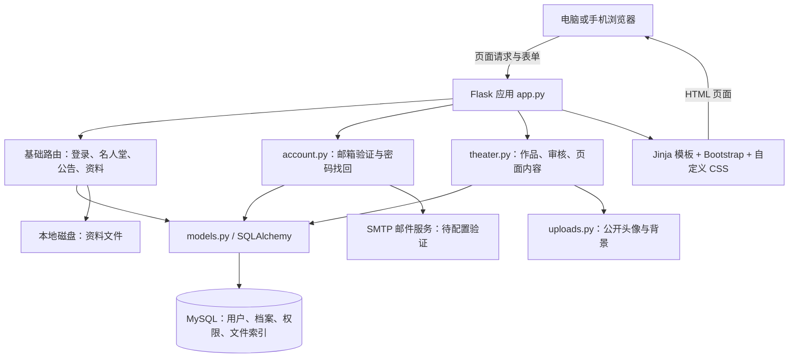
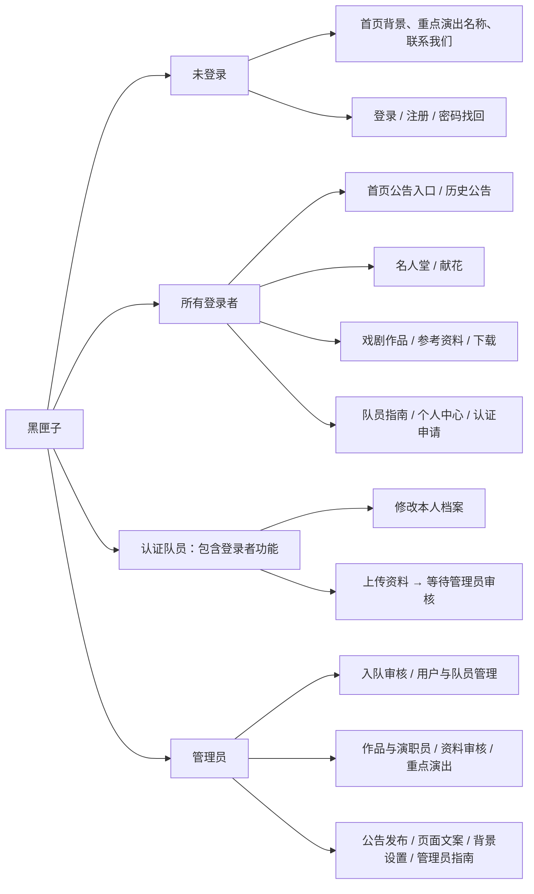
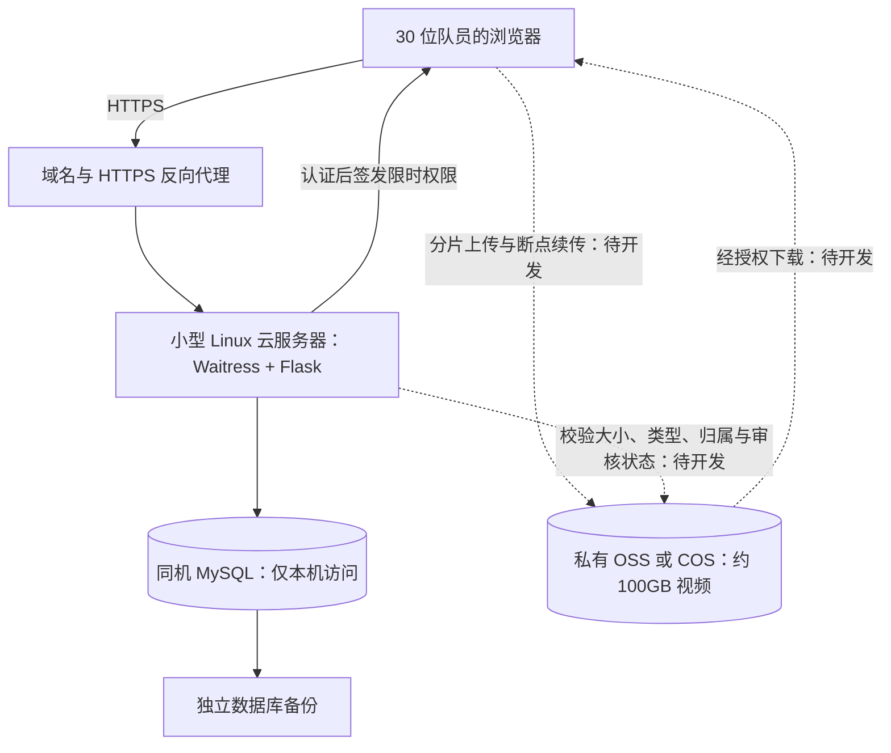

# 黑匣子：技术、功能与云端部署方案

更新：2026-09-08。已确认：大陆访问为主、约 30 人、视频总量约 100GB，单文件经常 1–5GB；尚无域名或服务器，先了解费用再决定。

## 当前技术图

这是服务端生成网页的单体项目，没有独立的 React 前端或必须新增的前端构建流程。数据库保存文件索引和审核状态，视频本体在磁盘。队员上传与已审核文件目前共用资源目录，访问权限由 Flask 核对；不能让反向代理直接公开整个 static 目录，否则可能绕过资源鉴权。Bootstrap 当前来自公共 CDN，选定大陆部署后应改为本地静态文件并测试加载。

## 功能图

公告不在顶部导航中，登录后从首页进入；“发布公告”仍是管理员的操作入口。上传入口在“作品与资料”中，联系我们在首页下方。

## 已完成的工程整理

- 六个数据库迁移文件合并成 `migrate.py`，一个命令按顺序完成升级；保留各阶段函数方便回归测试。
- 修复旧版剧团设置表缺少新字段时，迁移提前读取新模型导致失败的问题；先补齐字段，再读取记录。
- 头像和首页背景使用同一份 `uploads.py`，删除重复保存逻辑。
- 补齐 `requirements.txt`、`.env.example`、README 和生产启动入口 `serve.py`。
- 数据库连接中的用户名和密码经过 URL 编码，支持含特殊字符的密码。
- 本地资源目录可通过环境变量指向独立持久化磁盘，不自动移动现有文件。

没有把全部代码合到一个巨型文件，也没有为了减少文件数删除测试或教学文档。历史上下文中的旧迁移命令以 README 为准。

## 适合当前规模的拟议部署

建议先从 2 核、2–4GB 内存评估，实际规格由并发测试决定。服务器运行页面和数据库，视频由对象存储接收和分发。暂不增加托管数据库、转码平台或 CDN。

**对象存储、大文件分片上传和断点续传还没有实现。** 当前普通表单上限为 200MB，不能把它简单调成 5GB 就当作完成。下一阶段需落实：短时上传授权、随机对象键、续传、完成后服务端校验、未完成分片清理、私有文件下载及原有管理员审核。待审核文件只能上传者和管理员读取；管理员通过后，其他登录者才可访问。

Waitress 会缓冲完整请求，因此 1–5GB 视频应直传对象存储，不经小服务器中转。[Flask 官方部署文档](https://flask.palletsprojects.com/en/stable/deploying/waitress/)

## 地点选择

**大陆服务器 + 同地域对象存储**：适合主要在大陆使用，正式启用域名前须完成备案。具体资料、域名和接入条件依服务商及当地要求确认。[阿里云备案说明](https://help.aliyun.com/zh/icp-filing/basic-icp-service/product-overview/what-is-an-icp-filing)

**香港服务器 + 香港对象存储**：可优先评估快速测试，但应先从学校网络及手机网络实测上传下载速度，不保证跨境链路体验；选择后还需确认域名、服务条款及实际资源报价。低价套餐和库存有条件，不能拿促销首页价格当续费预算。[阿里云轻量服务器常见问题](https://help.aliyun.com/zh/simple-application-server/support/faq)

## 费用怎么理解

总费用分为：网站服务器 + 视频存储 + 下载流量 + 请求费用 + 域名 + 备份。视频上传 100GB 与每月下载 100GB 是两个概念。30 人每人下载 10GB，就是每月 300GB；30 人各下载整个 100GB 库一遍，就是 3000GB。

官方 OSS 页面分别列出存储、流量、请求等费用。官方计费案例使用过 0.50 元/GB 的外网下载单价；这里只借它做计算示例，**不是所选地区的现价，也不是购买报价**。[OSS 价格入口](https://www.aliyun.com/price/detail/oss) · [官方计费案例](https://help.aliyun.com/zh/oss/billing-examples)

为了先判断能否接受，采用以下**预算假设**：服务器 60 元/月、100GB 存储 15 元/月、下载 0.50 元/GB。前两项是规划占位，不代表已核实套餐。则：

- 月下载 100GB：约 125 元/月。
- 月下载 300GB：约 225 元/月。
- 月下载 1000GB：约 575 元/月。
- 全员各下载全部视频一次（3000GB）：约 1575 元，仅这个月。

上述示例尚未计入域名年费、请求、备份、税费、可能的额外服务；也未扣资源包优惠。大陆与香港需分别用购买页实际价格重新计算。**现在可以先以约 150–300 元/月作为轻度使用的预算讨论区间，不能视为费用上限。** 设置费用预警后仍需监控用量，预警不会自动停止收费。对象存储视频直传时，服务器套餐的流量额度不能抵扣对象存储下载流量。

另一条路线是买足够大的持久化数据盘并让服务器承担下载，可能利用套餐流量，但需额外处理大文件续传、磁盘备份和带宽，并预留明显高于 100GB 的容量。未获得实际服务器报价前，不能认定它一定更便宜。

## 选定路线后再执行

1. 确认大陆/香港、月预算及预计下载量，核对具体套餐首购与续费报价。
2. 用户购买服务器、域名和所选私有存储；不在聊天中提供密码或密钥。
3. 实现所选对象存储的大文件上传、审核和授权下载，先用小文件与中断续传测试。
4. 配置 HTTPS、系统服务、独立数据库账号、首次管理员及备份恢复流程；完善当前旧表单的 CSRF 和登录/上传频率限制后再邀请队员。
5. 迁移现有数据，验证管理员和普通账号权限，验证 1–5GB 文件及实际网络速度，再开放内部测试。

当前没有购买、创建或发布任何云端资源。
